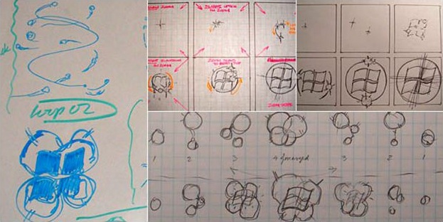

# Windows 7 Boot Simulation


This project aims to simulate the boot process of Windows 7.

## Main Script

The main logic of the simulation is implemented in the `win7.py` file. Make sure to review and run this script to see the simulation in action.

## How to Run

1. Ensure you have Python installed on your system.
2. Run the following command in your terminal:

   ```bash
   python win7.py
   ```

# Windows 7 boot animation sketches

